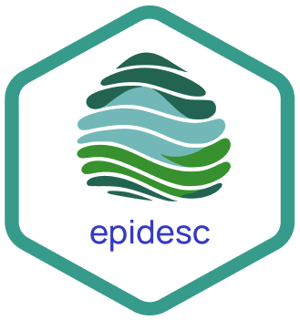

# epidesc   

<!-- badges: start -->
[](https://www.gnu.org/licenses/agpl-2.0.html)
<!-- badges: end -->



## Overview

The R package **epidesc** provides the tools to easily compute a series of epidemiological indicators to characterise different transmission profiles of infectious diseases. The work is based on the publication How heterogeneous is the dengue transmission profile in Brazil? A study in six Brazilian states (https://doi.org/10.1371/journal.pntd.0010746) published in PLoS Neglected Tropical Diseases by Iasmim Ferreira de Almeida, Raquel Martins Lana and Cláudia Torres Codeço in 2022. 

The **epidesc** pipeline to compute the indicators is the following:
* Formatting dates in *epiyearweek* format.
* Choosing descriptors and its parameters from the catalogue.
* Compute descriptors.

In order to work, the data used to compute the descriptors needs to have a few simple requirements:
* The input data has to be a data.frame with the cases and spatiotemporal identifiers.
* The data needs to be weekly with dates in Date format.
* If an incidence descriptor is required, the population at risk also needs to be provided.

To find out more, please have a look at the package vignette.

## Included descriptors

The current version of the package includes the following descriptors:

``` r
library("epidesc")
knitr::kable(desc_list())
```

|class                |fun   |description                                                                      |param1 |param2 |
|:--------------------|:-----|:--------------------------------------------------------------------------------|:------|:------|
|Peak                 |Ap    |Maximum cases peak                                                               |       |       |
|Peak                 |Tp    |Week where the maximum peak occurred                                             |       |       |
|Period with cases    |Cnf   |Frequency of periods of consecutive 'n' weeks or longer with at least 'x' cases  |n      |x      |
|Period with cases    |Cmax  |Maximum duration in consecutive weeks with at least 'x' cases                    |x      |       |
|Period with cases    |Cmed  |Median duration in consecutive weeks with at least 'x' cases                     |x      |       |
|Period with cases    |Isof  |Number of weeks with isolated cases                                              |       |       |
|Period with cases    |p     |Proportion of weeks with at least 'x' cases                                      |x      |       |
|Period without cases |Cwf   |Frequency of periods of consecutive weeks with at least 'n' weeks without cases. |n      |       |
|Period without cases |Cwmax |Maximum duration in consecutive weeks without cases                              |       |       |
|Period without cases |Cwmed |Median duration in consecutive weeks without cases                               |       |       |
|Incidence            |Inc   |Annual incidence per 'p' persons                                                 |p      |       |

## Contributions

We are very interested in keep expanding **epidesc** with new descriptors and we are open to contributions. If would like to contribute,
please open an issue with your idea or get in touch with Raquel Martins (raquel.lana@bsc.es) or Carles Milà (carles.milagarcia@bsc.es) to discuss its inclusion.

## Installation

`epidesc` is still in development and not on CRAN. You can install the development version of epidesc as follows:

``` r
devtools::install_git("https://earth.bsc.es/gitlab/ghr/ghrmodel.git")
```

## Package authors 

**[Raquel Martins, PhD](https://www.bsc.es/martins-lana-raquel)**
<a href="https://orcid.org/0000-0002-7573-1364" style="margin-left: 15px;"></a>\
Barcelona Supercomputing Center

**[Carles Milà, PhD](https://www.bsc.es/mila-garcia-carles)**
<a href="https://orcid.org/0000-0003-0470-0760" style="margin-left: 15px;"></a>\
Barcelona Supercomputing Center

**Iasmin Ferreira de Almeida, PhD**\
Getulio Vargas Foundation (FGV)

**Claudia Torres Codeço, PhD**
<a href="https://orcid.org/0000-0003-1174-178X" style="margin-left: 15px;"></a>\
Oswaldo Cruz Foundation (Fiocruz)

**[Daniela Lührsen, MSc](https://www.bsc.es/luhrsen-daniela-sofie)**
<a href="https://orcid.org/0009-0002-6340-5964" style="margin-left: 15px;"></a>\
Barcelona Supercomputing Center

**Diego Ricardo Xavier Silva, PhD**
<a href="https://orcid.org/0000-0001-5259-7732" style="margin-left: 15px;"></a>\
Oswaldo Cruz Foundation (Fiocruz)

**Christovam Barcellos, PhD**
<a href="https://orcid.org/0000-0002-1161-2753" style="margin-left: 15px;"></a>\
Oswaldo Cruz Foundation (Fiocruz)

**Raphael Saldanha, PhD**
<a href="https://orcid.org/0000-0003-0652-8466" style="margin-left: 15px;"></a>\
Oswaldo Cruz Foundation (Fiocruz)

**[Rachel Lowe, PhD](https://www.bsc.es/lowe-rachel)**
<a href="https://orcid.org/0000-0003-3939-7343" style="margin-left: 15px;"></a>\
Barcelona Supercomputing Center